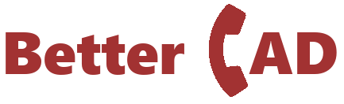

<p align="center"></p>

## About BetterCAD

BetterCAD is a **WORK IN PROGRESS** Computer Aided Dispatch system focused on
open-source and full customization.

## Project setup

```shell
composer install
npm install
npm run dev
php artisan migrate
```

Copy `.env.example` to `.env` and fill in the MYSQL and Pusher variables.
Or, if you're a pro - just set the appropriate environment variables.

Use `php artisan serve` to start the backend. To work on the frontend,
use `npm run watch`, which will watch the typescript as you write it.

Before submitting backend code in a pull request, use
`phpcs --standard=PSR12 app` to check for PSR12 standard violations.

## License

BetterCAD is licensed under GNUGPLv3.

## Attributions

- [Laravel](https://github.com/laravel/laravel.git) - Base framework for the entire project
- [FontAwesome](https://fontawesome.com) - Icons
- [Vue](https://github.com/vuejs/vue) - Client-side framework
- [Pusher](https://pusher.com) - Live data connection
